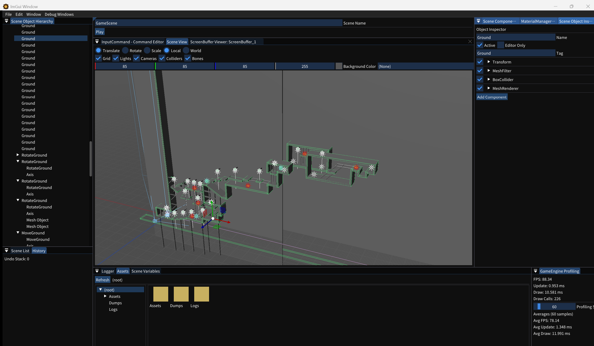

 
 

# KashipanEngine

『菓子パンのように安っちいが手に取りやすく、ちょっとしたことであれば簡単に実装できる』をコンセプトにした、Windows向け個人製ゲームエンジンです。

## 目次
- [KashipanEngineとは](#overview)
- [出来ること・出来ないこと](#features)
- [動作要件・ビルド方法](#requirements)
- [使い方](#usage)
- [スクリーンショット](#screenshots)
- [ゲームエンジンリファレンス](#reference)
- [使用ライブラリ](#libraries)
- [開発について](#development)
- [ライセンス](#license)

## KashipanEngineとは
KashipanEngineは、『菓子パンのように安っちいが手に取りやすく、ちょっとしたことであれば簡単に実装できる』をコンセプトにしたゲームエンジンです。  
ゲーム画面自体の映えや作れるゲームのジャンルの範囲はそこそこですが、手軽にゲームを作成できることを目指しています。 

## 出来ること・出来ないこと
KashipanEngineはゲームエンジンではあるものの、個人で制作しているゲームエンジンであるためUnityやUnreal、Godotといった有名なゲームエンジンには到底及びません。
あくまで小規模～中規模のゲームを作ったりちょっとしたプロトを作ったりするためのゲームエンジンであることをご了承ください。

| 出来ること | 出来ないこと |
| --- | --- |
| Windows環境を想定したゲーム制作 | MacやAndroid、WebなどといったWindows環境以外の環境を想定したゲーム制作 |
| ミニゲーム程度の規模のゲームや、複数ステージに分割されているパズルゲーム、アクションゲームの制作 | 広大なステージを歩き回ったり、ハイポリなモデルが複数置かれたりゲーム内のオブジェクト数が数万個あるといった大規模なゲームの制作 |
| そこそこ良い感じのライティングされた画面の制作 | UnityやUnreal Engineのように本格的なライティング |
| ちょっとしたオブジェクトの挙動の作成 | 本格的な物理挙動や流体シミュレーション |
| ウィンドウを用いたゲームの制作（KashipanEngineの特色として、ウィンドウが複数作成できたり透明なウィンドウを作成できたりするといったことが可能なため。） | |

## 動作要件・ビルド方法
- **Visual Studio 2026以降が必要です。Visual Studio 2022はサポート対象外です。**
- `KashipanEngine.sln`をVisual Studio 2026で開き、**スタートアッププロジェクトを`KashipanEngine`または`KashipanHub`に設定してから**ビルドしてください。

## 使い方
エディターの操作方法やゲーム制作のチュートリアルは、[エンジンリファレンスサイトのガイドページ](https://suzuki-ion.github.io/KashipanEngine/Editor/Guide/00_Index.html)にまとまっています。

## スクリーンショット

  

シーンエディターの画面。階層/シーンビュー/インスペクター/アセットブラウザ等を1つのウィンドウにまとめています。

## ゲームエンジンリファレンス
KashipanEngineの内部コード、及びエディター上の操作やオブジェクトのコンポーネントなどといったリファレンスは[こちらのページ](https://suzuki-ion.github.io/KashipanEngine/)にすべてまとまっています。

## 使用ライブラリ
- [DirectX 12](https://learn.microsoft.com/en-us/windows/win32/direct3d12/directx-12-programming-guide)
- [DirectXTex](https://github.com/microsoft/directxtex)
- [ImGui](https://github.com/ocornut/imgui)
- [Assimp 5.3.0](https://github.com/assimp)
- [React Physics 3D](https://github.com/DanielChappuis/reactphysics3d)
- [nlohmann/json](https://github.com/nlohmann/json)
- [UTF8-CPP](https://github.com/nemtrif/utfcpp)
- [Angel Script](https://github.com/anjo76/angelscript)
- [Microsoft Edge WebView2](https://learn.microsoft.com/en-us/microsoft-edge/webview2/)

## 開発について
KashipanEngineの開発では、AIコーディングツールである[Claude Code](https://claude.com/claude-code)を補助的に使用しています。実装方針の検討や設計は開発者自身が行い、Claude Codeはその補助として利用しています。

## ライセンス
KashipanEngineは[MIT License](LICENSE)で公開しています。商用利用・再配布・改変も自由に行っていただけます。

なお、`Externals/`配下で使用しているサードパーティライブラリは、それぞれ以下の各ライブラリ自身のライセンスに従います。組み込み・再配布の際はご注意ください。

| ライブラリ | ライセンス |
| --- | --- |
| DirectX 12 | Microsoft Software License Terms（Windows SDKに同梱） |
| DirectXTex | MIT License |
| ImGui | MIT License |
| Assimp | BSD 3-Clause License |
| React Physics 3D | zlib License |
| nlohmann/json | MIT License |
| UTF8-CPP | Boost Software License 1.0 |
| Angel Script | zlib License（※KashipanEngineにて一部改変） |
| Microsoft Edge WebView2 | BSD 3-Clause License（SDK/ローダー部分。実行時のWebView2 Runtime本体は別扱い） |

※ Angel Scriptについては、スクリプト読み込み時にフォルダパスへ日本語（非ASCII文字）が含まれていると読み込みに失敗する不具合を修正するため、KashipanEngine独自に`scriptbuilder.cpp`の一部を改変しています。改変内容の詳細は[`Project/LICENSE.txt`](Project/LICENSE.txt)に記載しています。

なお`Project/LICENSE.txt`には、KashipanEngine本体のライセンスと上記サードパーティライブラリすべてのライセンス全文をまとめています。このファイルはビルド時に自動でビルド後の実行ファイルと同じフォルダへコピーされ、配布物にも同梱されます。
